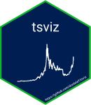

<!-- README.md is generated from README.Rmd. Please edit that file -->

```{r, include = FALSE}
knitr::opts_chunk$set(
  collapse = TRUE,
  comment = "#>",
  fig.path = "man/figures/README-",
  out.width = "100%"
)
```
# tsviz

<!-- badges: start -->
[](https://www.tidyverse.org/lifecycle/#experimental)
[](https://CRAN.R-project.org/package=tsviz)
[](https://cran.r-project.org/package=tsviz)
[](https://travis-ci.org/donlelef/tsviz)
<!-- badges: end -->



An RStudio addin to provide easy and interactive time series visualization.
To be visible to the addin, time series must be stored in a dataframe in the global environment, with:

- at least a column of type *Date*
- at least a column of type *numeric*

## Installation

You can install the released version of tsviz from [CRAN](https://CRAN.R-project.org) with:

```{r cran_install, eval=FALSE}
install.packages("tsviz")
```

Or install the development version from Github:

```{r github_install, eval=FALSE}
devtools::install_github("donlelef/tsviz")
```

Once you have installed the package, you do not need to load it with `library()`, the addins are installed on your machine as part of the package install process.

## Example

First, let us load some suitable data:

```{r example, message=FALSE}
library(tsviz)
prices <- crypto_prices
```

Then, we can run the addin:


That's it.
